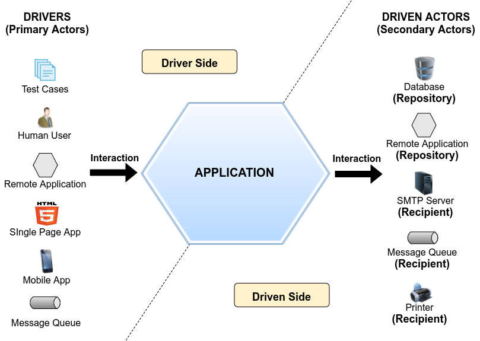

# Rodrigo Branas Clean Architecture

Estudo da live fullCycle com o Rodrigo Branas

# TODO

[ ] Procurar alguma coisa com o backend talvez meio funcionalzinha para o express

# Notas

## Ports & Adapters Architecture (Alistair Cockburn)

Ponto principal desse cara é separar o código da aplicação dos recursos que ela consome.  
No exemplo aqui seria a api, porque no instante do commit `759ee112` o meu teste não funciona sem o backend rodando  
Outro ponto seria não levar as regras de negócio para dentro dos drivers/controllers

## Dependency Inversion e Source code Dependency (Bob Marting)

Existe duas linha que guiam qualquer código que escrevemos `source code dependency` e `fluxo de controle`.  
Tradicionalmente elas apontam para o mesmo sentido

## Orientação a objetos

Distribuir a complexidade

1. A arte de proteger a invariância
2. Imposição da disciplina na transferência indireta de controle

## Piramide de Teste

Fazendo o refactor em entity eu isolo as regras de negócio do front tirando as dependências relacionadas com o vue e deixando os testes mais simples de implementar, fazer e rodar. Permitindo realizar mais teses de comportamento

## Clean Architecture

A arte de separar responsabilidades

Os use cases meio que vão bater com os componentes

## Menções de livros

- [Patterns of Enterprise Application Architecture](https://www.amazon.com.br/Patterns-Enterprise-Application-Architecture-Martin/dp/0321127420)

# Créditos

- [Rodrigo Branas](https://github.com/rodrigobranas)
- [Wesley Willians](https://github.com/wesleywillians)

# Fontes

- [clean_architecture_frontend_fullcycle](https://github.com/rodrigobranas/clean_architecture_frontend_fullcycle/tree/master)
- [Live Clean Architecture do Back para o Frontend](https://www.youtube.com/watch?v=O7Yclo_jbFY)
